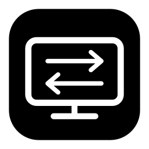

<p align="center"></p>
<h1 align="center">MonitorSwitch</h1>
<p align="center">One keyboard. One display. Three devices.</p>

MonitorSwitch follows the **physical Logitech Easy-Switch buttons** and changes a shared monitor's input. A native macOS menu-bar app and small Windows tray companions coordinate over your local network. Free, local and open source: no subscription, account or cloud.

## How it works

| Easy-Switch button | Device | Default monitor input |
| --- | --- | --- |
| **1** | Device 1 · Windows companion | HDMI 1 · DDC code 17 |
| **2** | Device 2 · macOS menu-bar app | USB-C · DDC code 16 |
| **3** | Device 3 · Windows companion | HDMI 2 · DDC code 18 |

The keyboard's own Easy-Switch action controls the keyboard connection. MonitorSwitch follows that action; it does not re-pair devices or switch your mouse. If your mouse already follows the keyboard through Logitech’s own feature, it continues to do so independently.

Windows helpers identify the keyboard and announce confirmed device changes using authenticated UDP messages. The macOS coordinator controls the monitor through `m1ddc`. A Windows helper can send the return-input DDC command over HDMI when the monitor no longer accepts commands on the inactive USB-C connection. A confirmed Bolt ChangeHost notification provides the fast return path on Device 3. A disconnect alone is never treated as a destination selection.

## Compatibility

This release targets the configuration it was developed with:

- One Apple Silicon Mac; select its **Easy-Switch channel 1, 2 or 3** in setup.
- Windows computers on the remaining channels.
- Logitech **MX Keys Mini for Business**, Bluetooth and Logi Bolt.
- **MSI G274QPF** with DDC/CI enabled, HDMI 1 / USB-C / HDMI 2.
- Computers awake and reachable on the same local IPv4 network.

The setup form lets you choose device names, operating systems, a detected monitor and input codes. Windows monitor identification and the coordinator return-input code are also configurable. Hardware validation was performed with the devices above. The fast Bolt return notification is currently enabled only for Windows channel 3 → macOS channel 2; other assignments use confirmed connection events and may take longer. Other keyboards and monitors are not guaranteed to work.

No administrator privileges are required for normal Windows operation or its per-user startup. Corporate application, HID or firewall policies may restrict operation; MonitorSwitch does not change or circumvent those policies. Allow local UDP traffic to the macOS coordinator on port **25347** if your network policy permits it. Pairing messages have timestamp and replay checks, so keep the system clocks synchronized.

## Build the macOS app

Requires macOS 12 or later on Apple Silicon, Xcode Command Line Tools (Clang, Make, Swift and Python 3), and the included `m1ddc` source.

```sh
zsh build.sh
```

Output: `build/MonitorSwitch.app`. The build does **not** install configuration, change startup settings or replace pairing keys. Its built-in parser checks run during the build. The local app is ad-hoc signed, not notarized; this repository does not provide an Apple Developer-signed distribution.

## Pair your devices

1. Connect the monitor, enable DDC/CI and pair each physical keyboard channel with its computer.
2. Open the macOS app. **Setup devices…** opens on first launch; it is also available in the menu. Assign exactly one row to **macOS** and the other rows to **Windows**. Select your connected monitor, its input for each device, its Windows monitor name and this Mac's LAN IPv4 address. Save the setup. The app creates private pairing keys automatically and preserves existing keys.
3. Choose **Export Windows profiles…** and select a folder. Transfer each exported JSON profile privately to its matching Windows computer.
4. On Windows, extract the public Windows archive and run **MonitorSwitch.exe**. On first launch, the setup form opens. Click **Import profile…**, select that computer's JSON file and click **Save**. The tray icon appears. You can reopen the form through **Setup device…**.
5. Grant **Input Monitoring** to the macOS app in System Settings → Privacy & Security if requested, then restart it. macOS may require authentication to grant that permission; Windows setup does not request administrator privileges.
6. Test the physical buttons with all computers awake. If you change device numbers or monitor input mappings, export and import updated Windows profiles.

The default mapping in the table above is editable. One macOS coordinator is required; a Windows-only configuration and multiple macOS coordinators are not supported.

Private profiles and pairing configurations contain keys. Do not upload them to GitHub or share them publicly. The generic public archive contains no pairing data. Advanced command-line setup remains available in `scripts/configure.py` for the default channel arrangement; normal setup uses the interface.

## macOS menu

- **Device 1 / Device 2 / Device 3** — manually request the associated input.
- **Follow Easy-Switch** — enable or pause automatic following.
- **Setup devices…** — choose device names, macOS / Windows, monitor and inputs.
- **Export Windows profiles…** — save private pairing files for the Windows companions.
- **Diagnostics → Observe only** — log automatic events without switching the display.
- **Diagnostics → Read current input** — request the current DDC input value.
- **Diagnostics → Open logs folder** — open `~/Library/Logs/MonitorSwitch`.
- **Quit MonitorSwitch** — stop the app and its local relay.

The device checkmark represents the last requested channel. A successful DDC write is reported as a command sent; it does not prove which picture is visible after the inactive connection stops responding.

For macOS login startup, add the same app bundle to System Settings → General → Login Items. Keep the installed app at a stable path. A rebuild changes an ad-hoc signature and may require re-enabling Input Monitoring.

Windows **0.10.0-test1** is an unsigned native test build. The previous PowerShell version triggered a Kaspersky behavior warning; antivirus compatibility and physical switching for the replacement remain pending. See [Windows README](windows/README.md#antivirus-test-build).

## Windows tray menu

- **Follow Easy-Switch** — start or stop the helper, with a running-process checkmark.
- **Launch at sign-in** — enable or disable current-user startup; the checkmark reflects the Startup shortcut.
- **Setup device…** — import a profile or edit this computer’s settings.
- **Diagnostics** — open logs or export a diagnostic ZIP without configuration or pairing keys.
- **Quit MonitorSwitch** — stop the tray app and its child helper.

This is a user-session application, not a Windows service. It starts after sign-in when enabled. No scheduled task, registry startup entry or elevated installer is used. A per-user mutex prevents duplicate native instances. Windows uses one compiled C# / WinForms application with native HID/DDC APIs and .NET Framework 4.8. It does not launch PowerShell, change execution policy or install a service.

## Troubleshooting

**No tray icon:** check the hidden-icons arrow. Extract the full package and use the setup form to import your device profile. Quit an older helper before upgrading. If needed, use `Run-Diagnostic.cmd` after quitting the tray app.

**The macOS input does not return:** keep both apps running and the computers awake. Check the Windows diagnostic log for receiver readiness and confirmed keyboard identity. Bluetooth reconnection can take longer than the confirmed Bolt event path.

**Display returns to another source:** automatic input detection in the monitor can override a source without a live video signal. Test with the destination computer awake and producing a signal.

**Permission changed after a rebuild:** re-enable Input Monitoring for the same macOS bundle and restart. Ad-hoc signing cannot guarantee a stable macOS permission identity across builds.

**DDC writes fail:** check DDC/CI, the selected display UUID and input codes. Some docks, cables and inactive monitor inputs do not carry DDC commands. This release's Windows identification intentionally avoids changing unrelated displays.

**Diagnostics:** macOS logs live in `~/Library/Logs/MonitorSwitch`; Windows logs live in `%LOCALAPPDATA%\MonitorSwitch\Native`. Logs record service messages and hardware/network diagnostics, not typed text. They may contain local addresses and device identifiers: review before sharing. Never share pairing files.

## Development and release packaging

```sh
python3 -m unittest discover -s tests
python3 -m py_compile network_follow.py scripts/configure.py
python3 scripts/package.py  # after building the Windows executable
```

On Windows, run `windows\native\build.cmd` to compile the executable using the .NET Framework C# compiler. CI also runs native UI, icon, authenticated input and cross-language packet checks.

The public Windows ZIP is created in `build/release/`. The macOS app can be archived after building; paired configurations, historical experimental builds and diagnostics are excluded from public artifacts.

## License and credits

MonitorSwitch code is MIT licensed. See [LICENSE](LICENSE) and [THIRD_PARTY_NOTICES.md](THIRD_PARTY_NOTICES.md).

- [m1ddc](https://github.com/waydabber/m1ddc) by waydabber — included macOS DDC/CI implementation, MIT.
- [mxswitch](https://github.com/marcocosta97/mxswitch) by Marco Costa — Windows native HID enumeration adapted under MIT; its notice is retained in the helper.
- [SwiGi](https://github.com/LeeHoffka/SwiGi) and [OpenLogi HID++ ChangeHost documentation](https://openlogi.org/hidpp/features/x1814-change-host) — protocol references.

MonitorSwitch is an independent project and is not affiliated with Logitech, MSI or Apple.
